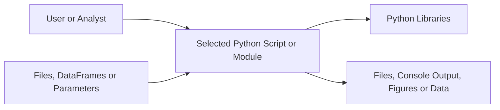
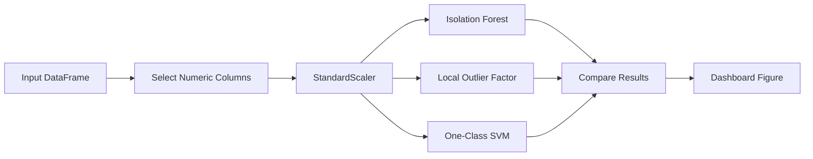

# Python Scripts

> **Document version:** R1.00  
> **Documentation status:** Reviewed from repository evidence  
> **Last code review:** 2026-07-14  
> **Repository:** https://github.com/Wattysaid/Python_scripts  
> **Default branch:** `main`  
> **Commit reviewed:** `ee74e0fa8f6941eee46a5a4f047cfe35b6254902`  
> **Maintainer:** Wattysaid

Python Scripts is a personal collection of standalone automation, data-processing and analytical utilities. The repository includes file-management scripts, document-processing helpers, duplicate and dependency checks, and a growing set of data-science visualisation functions, including anomaly-detection and outlier-analysis dashboards.

## Documentation Scope and Verification

| Item | Value |
|---|---|
| Repository reviewed | `https://github.com/Wattysaid/Python_scripts` |
| Branch | `main` |
| Commit | `ee74e0fa8f6941eee46a5a4f047cfe35b6254902` |
| Review date | `2026-07-14` |
| Reviewer | `GPT-5.6 Thinking` |
| Review method | Static inspection of README and latest commit diff |
| Commands executed | None; scripts were not run |
| Excluded areas | Full source-tree inventory, destructive script execution and environment-specific validation |
| Confidence | Medium; repository purpose and recent analytical functions are evidenced, but individual scripts were not exhaustively executed |

### Documentation Status Legend

| Status | Meaning |
|---|---|
| **Verified** | Confirmed through source inspection and successful validation or tests |
| **Implemented, not executed** | Code exists and was inspected, but runtime execution was not performed |
| **Partial** | Some expected handling or documentation is incomplete |
| **Unknown** | Evidence is insufficient or contradictory |

## Contents

- [Repository Purpose](#repository-purpose)
- [Capability Catalogue](#capability-catalogue)
- [Architecture and Execution Model](#architecture-and-execution-model)
- [Technology Stack](#technology-stack)
- [Recent Analytical Functions](#recent-analytical-functions)
- [Inputs, Outputs and Side Effects](#inputs-outputs-and-side-effects)
- [Variables and Configuration Governance](#variables-and-configuration-governance)
- [Testing and Quality Assurance](#testing-and-quality-assurance)
- [Getting Started](#getting-started)
- [Known Limitations and Risks](#known-limitations-and-risks)
- [Safe Change Guidance](#safe-change-guidance)
- [Release and Versioning](#release-and-versioning)
- [Changelog](#changelog)
- [Licence](#licence)

## Repository Purpose

The collection is intended to:

- Automate repetitive personal tasks.
- Support experimentation and learning in Python.
- Provide reusable utilities for file and data operations.
- Retain scripts that have previously saved manual effort.
- Offer reusable visualisation functions for exploratory and business analysis.

These scripts have not been validated as production-grade, enterprise-controlled or suitable for regulated decisions. Run them only after reviewing their inputs, outputs and side effects.

## Capability Catalogue

| Capability Area | Intended Outcome | Status | Examples or Evidence |
|---|---|---|---|
| File management | Copy, sort, rename, back up or clean files | Implemented, not executed | Original README describes bulk file operations |
| Document processing | Split or transform document content | Implemented, not executed | `Chapter_to_new_docx.py` was previously documented |
| Dependency inspection | Identify Python dependency requirements or issues | Unknown | Original README referenced `dependancy_checker.py`, but the documented root path was not found during review |
| Duplicate detection | Identify duplicated files or records | Unknown | Original README referenced `duplicated_checker.py`; current path was not verified |
| Data transformation | Parse and transform CSV, JSON and XML | Implemented across collection, not executed | Repository purpose and script categories |
| System utilities | Automate routine administration and maintenance | Implemented across collection, not executed | Repository purpose |
| Data visualisation | Produce statistical, analytical and business-report charts | Implemented, not executed | Latest commit adds extensive visualisation functions |
| Anomaly detection | Compare multiple anomaly and outlier-detection methods | Implemented, not executed | Isolation Forest, Local Outlier Factor, One-Class SVM and PCA functions in latest commit |

### Documentation Link Status

The previous README linked directly to several root-level files, including `Bulk_file_copy.py` and `dependancy_checker.py`. Those exact paths were not found during this review. The files may have been renamed, moved into subdirectories or removed. Do not delete similarly named scripts until the repository tree and commit history have been compared.

## Architecture and Execution Model

The repository is a collection rather than a single application. Each script or module may have its own dependencies, command-line assumptions, input paths and output behaviour.



### Architectural Boundaries

| Boundary | Responsibility | Typical Inputs | Typical Outputs |
|---|---|---|---|
| Automation scripts | Perform one specific operational task | File paths, folders or command parameters | Modified, copied or generated files |
| Data-processing scripts | Load and transform structured data | CSV, JSON, XML or DataFrames | Cleaned or summarised data |
| Visualisation modules | Create analytical charts and dashboards | pandas DataFrames and function parameters | Matplotlib figures |
| Utility and diagnostic scripts | Inspect dependencies, duplicates or system state | Repository, environment or file metadata | Reports or console output |

## Technology Stack

The exact dependency set varies by script. Recent visualisation code includes the following direct imports:

| Technology | Purpose | Evidence | Constraint |
|---|---|---|---|
| Python | Script runtime | Repository implementation | Exact supported version is not centrally documented |
| pandas | DataFrame selection, cleaning and analysis | Latest commit | Input columns and types must be validated |
| NumPy | Numerical arrays and calculations | Latest commit | Missing or infinite values may affect models |
| Matplotlib | Figure and dashboard creation | Latest commit | Figures must be closed by calling applications where appropriate |
| seaborn | Statistical visualisation | Latest commit | Visual style and dependency compatibility must be managed |
| SciPy | Statistical functions and z-scores | Latest commit | Constant or sparse data can produce invalid results |
| scikit-learn | Isolation Forest, LOF, One-Class SVM, scaling and PCA | Latest commit | Model assumptions and contamination settings affect outcomes |
| python-docx or related document libraries | Document generation in documented scripts | Previous README references | Exact dependency and path not verified |

No consolidated requirements or lock file was verified during this review.

## Recent Analytical Functions

### Anomaly Detection Dashboard

The latest reviewed commit contains a function that:

- Selects numeric columns from a DataFrame.
- Standardises numeric features.
- Runs Isolation Forest, Local Outlier Factor and One-Class SVM.
- Plots model scores in a four-panel dashboard.
- Calculates consensus and any-method anomalies.
- Reports method agreement.



### Outlier Analysis Plot

The reviewed implementation supports:

- Interquartile-range detection.
- Standard z-score detection.
- Modified z-score detection.
- Per-variable boxplots.
- Outlier counts and rates.
- Summary statistics for analysed columns.

### Multivariate Anomaly Analysis

The reviewed implementation scales numeric features, applies principal-component analysis and performs anomaly detection in the reduced feature space. Results are exploratory and require domain review before any operational decision.

## Inputs, Outputs and Side Effects

| Input | Typical Source | Validation Status | Output or Side Effect | Risk |
|---|---|---|---|---|
| File or folder paths | Script arguments or hard-coded values | Script-specific | Files copied, renamed, written or deleted | High for destructive operations |
| pandas DataFrame | Calling notebook or script | Numeric-column checks exist in recent visualisations | Figures, scores and summaries | Medium |
| Contamination rate | Function parameter | No reviewed bound validation | Number of observations classified as anomalous | High for interpretation |
| Document content | Local documents | Script-specific | New DOCX or transformed content | Medium |
| System or dependency metadata | Python environment | Script-specific | Diagnostic report | Low to medium |

## Variables and Configuration Governance

No central configuration layer or environment-variable inventory was verified. Configuration may be embedded in script constants, command-line parameters or function arguments.

| Configuration Type | Examples | Change Risk |
|---|---|---|
| File paths | Source, destination and output folders | High |
| File patterns | Extensions, names and duplicate criteria | Medium |
| Analytical thresholds | Contamination rate, z-score and IQR limits | High |
| Model settings | Random state, neighbours, kernels and PCA dimensions | Medium to high |
| Chart parameters | Figure size, labels and column limits | Low to medium |

### Change and Deletion Protocol

1. Search all scripts, notebooks and documentation for the exact and normalised name.
2. Check whether a script is imported by another module before renaming or moving it.
3. Review destructive file operations and test them against temporary directories.
4. Preserve existing function signatures unless a migration is documented.
5. Add configuration validation for thresholds and paths.
6. Update the capability catalogue and dependency information in the same change.

## Testing and Quality Assurance

No automated test suite or CI quality gate was verified.

| Test Type | Scope | Reviewed Result | Gap |
|---|---|---|---|
| Import test | Import every module without executing destructive work | Not run | Syntax and missing dependencies unknown |
| Unit test | Analytical functions with normal, empty and malformed DataFrames | Not run | Numerical edge cases unprotected |
| Filesystem integration | Copy, rename or duplicate scripts in temporary directories | Not run | Destructive behaviour unverified |
| Visual regression | Generate figures from fixed fixtures | Not run | Layout and numerical outputs unverified |
| Dependency installation | Install a consolidated manifest | Not run | No central requirements file verified |

## Getting Started

### Prerequisites

- A supported Python 3 environment.
- A virtual environment dedicated to the script being used.
- Backups or disposable test data for scripts that modify files.

### Generic Setup

```bash
git clone https://github.com/Wattysaid/Python_scripts.git
cd Python_scripts
python -m venv .venv

# Windows
.venv\Scripts\activate

# macOS or Linux
source .venv/bin/activate
```

Install dependencies only after reviewing the imports in the selected script. For recent anomaly and visualisation modules, the likely requirements include:

```bash
pip install pandas numpy matplotlib seaborn scipy scikit-learn
```

### Safe Execution Pattern

1. Open and review the selected script.
2. Identify all input paths, output paths and destructive operations.
3. Copy representative data into a temporary test directory.
4. Run the script from the virtual environment.
5. Review generated output before using real data.

## Known Limitations and Risks

| ID | Area | Finding | Impact | Priority | Recommended Action |
|---|---|---|---|---|---|
| DOC-RISK-001 | Documentation | Previous direct file links are stale or moved | Users cannot reliably locate documented utilities | P1 | Generate an automated script catalogue from the repository tree |
| DOC-RISK-002 | Dependencies | No consolidated dependency manifest was verified | Scripts may fail or conflict across environments | P1 | Add per-folder or repository-level requirements with tested versions |
| DOC-RISK-003 | Destructive operations | File-management scripts may alter real data | Data loss or unintended changes | P0 | Add dry-run modes, confirmations and temporary-directory tests |
| DOC-RISK-004 | Analytical interpretation | Anomaly classifications depend on configured algorithms and contamination | Misleading business conclusions | P1 | Add parameter validation, method guidance and domain review requirements |
| DOC-RISK-005 | Numerical edge cases | Modified z-score may divide by zero when median absolute deviation is zero | Invalid values or runtime warnings | P1 | Add zero-dispersion handling and tests |
| DOC-RISK-006 | Scale | Visualisation functions operate on in-memory DataFrames | Memory or rendering failures on large datasets | P2 | Add sampling, limits and performance tests |
| DOC-RISK-007 | Quality gates | No automated import, unit or integration tests were verified | Regressions can remain undetected | P1 | Add pytest and CI coverage by capability group |

## Safe Change Guidance

- Preserve all existing utilities and placeholders unless removal is explicitly authorised.
- Do not rename or move scripts without updating imports and documentation links.
- Add dry-run support before extending file-modifying utilities.
- Use deterministic random states for analytical functions where reproducibility matters.
- Validate empty, non-numeric, constant and missing-value datasets.
- Do not treat anomaly output as a decision without domain review.
- Add or update dependency manifests when imports change.
- Update this README whenever scripts, function signatures, dependencies or side effects change.

## Release and Versioning

| Item | Approach | Source of Truth |
|---|---|---|
| Script version | Commit-based unless defined in a module | Git history |
| Function contract version | Not formally versioned | Function signatures and documentation |
| Documentation version | `R1.00` | `README.md` |

## Changelog

| Documentation Version | Date | Commit Reviewed | Author | Summary |
|---|---|---|---|---|
| R1.00 | 2026-07-14 | `ee74e0fa8f6941eee46a5a4f047cfe35b6254902` | GPT-5.6 Thinking | Reorganised the collection documentation, retained original purpose and categories, documented recent anomaly-analysis functions and flagged stale file links |

## Licence

No licence file was verified. Unless a licence exists elsewhere in the repository, reuse rights are not granted by default.
